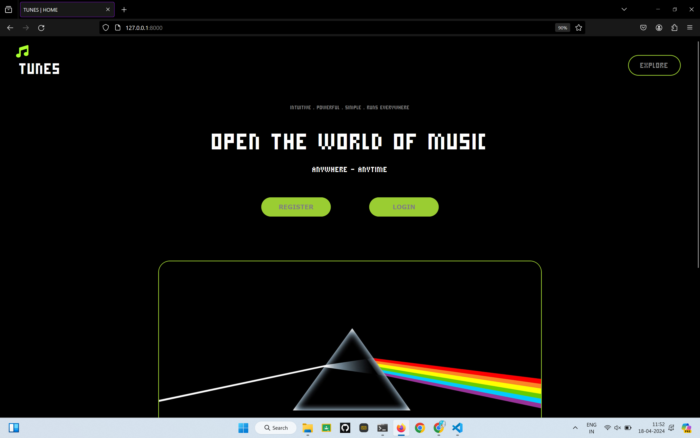
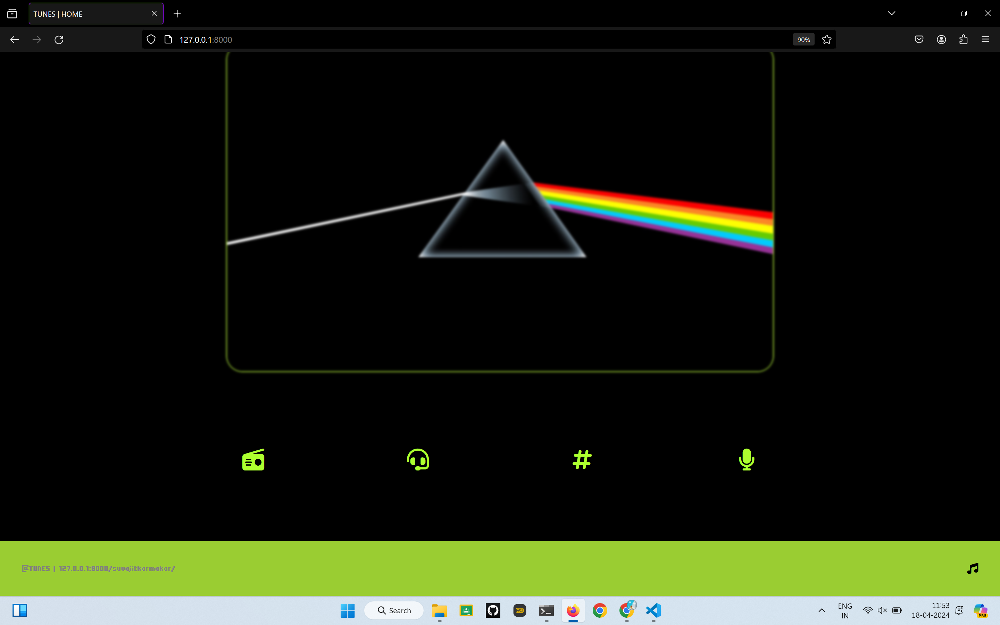
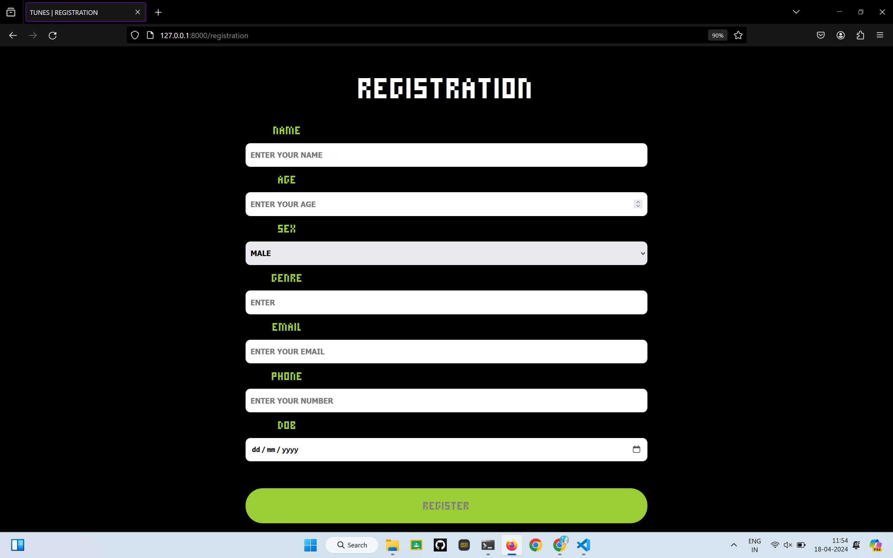
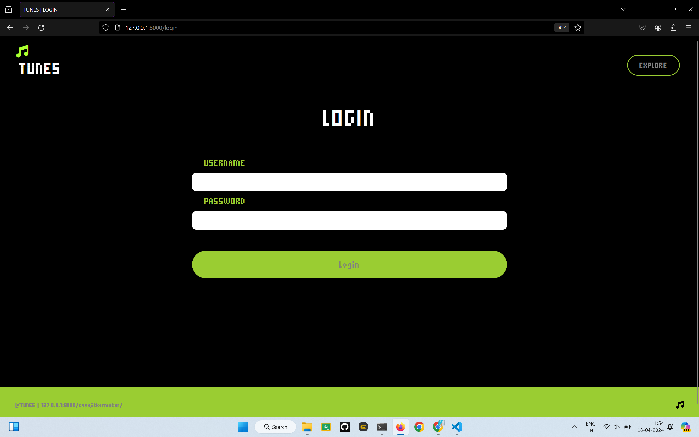

## TUNES USING FLASK
*A SIMPLE, EAST AND ONE STOP SOLUTION FOR MANAGING YOUR MUSIC LOADOUT*


### BADGES


[](https://choosealicense.com/licenses/mit/)

[](https://opensource.org/licenses/)

[](http://www.gnu.org/licenses/agpl-3.0)


## DEPLOYMENT

Git clone this application and run  locally 

```bash
  git clone git@github.com:SUVAJITKARMAKAR/TUNES-MUSIC-LOADOUT.git
```

```bash
  pip install flask
```

To run the application 
```bash
  python app.py
```


## FEATURES

- All dark mode so that you always have a comfortable eyr
- Real-time music loadout management
- Awesome UI/UX design
- Multi-platform support


### SCREENSHOTS






### AUTHOR 

- [@SUVAJITKARMAKAR](https://www.github.com/octokatherine)

